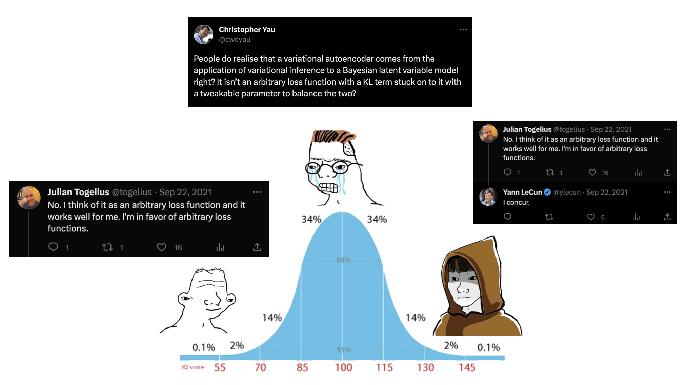

# Minified generative models

[](https://opensource.org/licenses/MIT)

Bare-bones, minified versions of some common (and not-so-common) generative models, for pedagogical purposes.

## Installation

First, install JAX following these [instructions](https://jax.readthedocs.io/en/latest/installation.html). For CPU-only, this is as simple as:
```bash
pip install "jax[cpu]"
```
In a virtual environment:
```bash
pip install flax optax diffrax tensorflow_probability scikit-learn tqdm matplotlib
```

## List of notebooks

1. [β-VAEs](01_beta_vae.ipynb): Variational autoencoders and basic rate-distortion theory.
2. [Diffusion models](02_diffusion.ipynb): Diffusion models, covering likelihood-based and score-matching interpretations.
3. [Normalizing flows](03_normalizing_flows.ipynb) (WiP annotations): Normalizing flows, specifically [RealNVP](https://arxiv.org/abs/1605.08803).
4. [Continuous normalizing flows](03_continuous_normalizing_flows.ipynb): Continuous-time normalizing flows from e.g., [Grathwohl et al 2018](https://arxiv.org/abs/1810.01367).
5. [Consistency models](04_consistency_models.ipynb) (WiP annotations): Consistency models from [Song et al 2023](https://arxiv.org/abs/2303.01469).
6. [Flow matching](05_flow_matching.ipynb) (WiP annotations): From [Lipman et al 2022](https://arxiv.org/abs/2210.02747); see also  [Albergo et al 2023](https://arxiv.org/abs/2303.08797).
7. [Diffusion distillation](06_diffusion_distillation.ipynb) (WiP): Progressive ([Salimans et al 2022](https://arxiv.org/abs/2202.00512)) and consistency ([Song et al 2023](https://arxiv.org/abs/2303.01469)) distillation.
8. [Discrete Walk-Jump Sampling](07_discrete_walk_jump_sampling.ipynb) (WiP): From [Frey et al 2023](https://arxiv.org/abs/2306.12360).

## Inspiration


